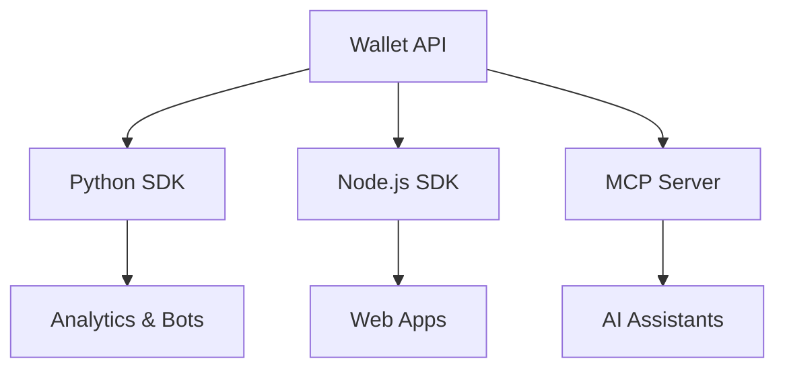

<div align="center">
  
  # 💎 Telegram Wallet P2P SDK Ecosystem
  
  ### *The ultimate developer-friendly, production-grade toolkit for the Telegram Wallet P2P market.*

  [](https://github.com/furkankoykiran/telegram-wallet-p2p-sdk/actions/workflows/ci.yml)
  [](LICENSE)
  [](https://www.npmjs.com/package/telegram-wallet-p2p)
  [](https://pypi.org/project/telegram-wallet-p2p/)
  [](https://modelcontextprotocol.io)

  ---

  **[Explorer](https://p2p.walletbot.me)** • **[Documentation](https://github.com/furkankoykiran/telegram-wallet-p2p-sdk)** • **[Community](CONTRIBUTING.md)**

</div>

<br/>

> [!WARNING]
> **UNOFFICIAL PROJECT**: This SDK is a community-driven, independent initiative. It is NOT affiliated with, endorsed by, or related to Telegram, Wallet, or any of their subsidiaries. This SDK is strictly **read-only** and designed for market intelligence and data monitoring.

## ✨ Why This SDK?

| Feature | Description |
| :--- | :--- |
| **🚀 Native Performance** | Zero-dependency Node.js client using native `fetch`. |
| **🐍 Async First** | High-concurrency Python client built on `aiohttp`. |
| **🔒 Type Safety** | Full TypeScript support and Pydantic v2 models. |
| **🧠 AI Integration** | Built-in **MCP Server** for Claude, Cursor, and more. |
| **📈 Intelligence** | Advanced analytics for spreads, best prices, and liquidity. |
| **💪 Resiliency** | Automatic exponential backoff for rate limits and server errors. |

---

## 📦 Monorepo Overview

This ecosystem provides three powerful tools designed to seamlessly integrate into your workflow:



| Package | Language | Key Tech | Best For |
| :--- | :--- | :--- | :--- |
| [**Python SDK**](packages/python) | `Python 3.9+` | `aiohttp`, `Pydantic` | Data science, trading bots. |
| [**Node.js SDK**](packages/node) | `TypeScript` | `fetch`, `Vite` | Web frontends, serverless. |
| [**MCP Server**](packages/mcp) | `TypeScript` | `MCP SDK`, `Zod` | AI-assisted market analysis. |

---

## ⚡ Quick Start

### 1. Get Your API Key
1. Open [Wallet](https://wallet.tg/) in Telegram.
2. Go to **P2P Market** → **My Profile** → **API Keys**.
3. Create a key and keep it safe!

### 2. Implementation

#### 🐍 Python
```bash
pip install telegram-wallet-p2p
```
```python
from telegram_wallet_p2p import WalletP2PClient, TradeSide

async with WalletP2PClient(api_key="your_key") as client:
    resp = await client.get_online_items(
        crypto_currency="USDT", 
        fiat_currency="RUB", 
        side=TradeSide.SELL
    )
    print(f"Top Price: {resp.data[0].price}")
```

#### 🌐 Node.js
```bash
npm install telegram-wallet-p2p
```
```typescript
import { WalletP2PClient, TradeSide } from "telegram-wallet-p2p";

const client = new WalletP2PClient({ apiKey: "your_key" });
const { data } = await client.getOnlineItems({ 
  cryptoCurrency: "TON", 
  fiatCurrency: "USD", 
  side: TradeSide.BUY 
});
console.log(`Best Buy: ${data[0].price}`);
```

---

## 🤖 Model Context Protocol (MCP)

Instantly empower your AI assistant with real-time market data.

### Install in VS Code / Cursor

Install the Telegram Wallet P2P MCP server in VS Code with one click:

[](https://insiders.vscode.dev/redirect?url=vscode%3Amcp%2Finstall%3F%7B%22name%22%3A%22telegram-wallet-p2p%22%2C%22command%22%3A%22npx%22%2C%22args%22%3A%5B%22-y%22%2C%22telegram-wallet-p2p-mcp%22%5D%2C%22env%22%3A%7B%22WALLET_P2P_API_KEY%22%3A%22YOUR_API_KEY%22%7D%7D)

> [!NOTE]
> After installing, replace `YOUR_API_KEY` with your actual Wallet API key.

### Install in Claude Desktop

Add this to your `claude_desktop_config.json`:

```json
{
  "mcpServers": {
    "telegram-wallet-p2p": {
      "command": "npx",
      "args": ["-y", "telegram-wallet-p2p-mcp"],
      "env": {
        "WALLET_P2P_API_KEY": "your-api-key"
      }
    }
  }
}
```

### 💡 Example Prompts for AI
- *"Find the cheapest USDT available for purchase with RUB right now."*
- *"Give me a summary of the current TON/USD market including merchant distribution."*
- *"List the top 5 sell ads for BTC/EUR that accept bank transfers."*

---

## 🤝 Contributing & Support

We welcome contributions! Please see our [**Contributing Guide**](CONTRIBUTING.md) for details on how to get started.

- ⭐️ **Star the repo** if you find it useful.
- 🐛 **Open an issue** for bugs or feature requests.

---

<div align="center">
  <sub>Built with ❤️ for the community by Furkan Köykıran</sub>
</div>